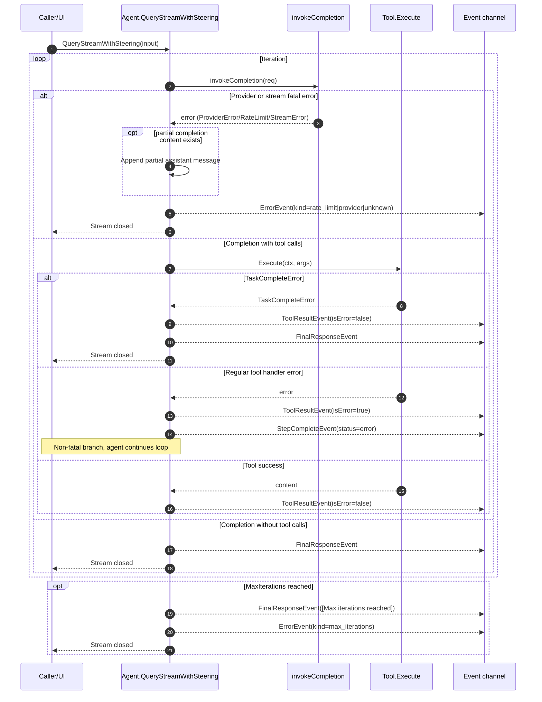

# Architecture

This document describes the current runtime architecture and component interactions.
Use `AGENTS.md` for fast orientation, then read only the sections needed for your task.

## Module Boundaries
- `sdk/agent/` owns loop orchestration, history state, event emission, tool dispatch, steering boundaries, and compaction integration (`sdk/agent/agent.go:20`, `sdk/agent/events.go:10`, `sdk/agent/agent.go:838`)
- Provider-owned continuation data lives in opaque `llm.ProviderState` records
  encoded by `llm.WithProviderState` in a reserved, non-rendering
  `ContentBlock`. This preserves the public positional shape of `Message` and
  `Completion`. The agent clones and persists successful completion state with
  assistant history; provider adapters alone validate and replay matching
  records. Any local mutation that invalidates an assistant representation
  clears it with `llm.WithoutProviderState`, except a pending max-token tool
  continuation, which must replay the exact provider output on the next call.
- `sdk/accounting/` owns the versioned, bounded semantic projection for tool
  results, provider usage, and compaction. It allowlists measurements and
  disposition fields, keeps unknown distinct from zero, requires a named/
  versioned/policy-hashed estimator for comparable local tokens, and never
  copies raw result or arbitrary metadata. Runtime hosts own identity and
  persistence.
- `sdk/agent/messageorigin/` owns stable names for framework-authored
  user-role messages and the shared `IsRealUserMessage` classifier used by the
  agent loop and compaction.
- `sdk/llm/` defines provider-neutral request/response contracts and stream event types (`sdk/llm/model.go:8`, `sdk/llm/model.go:24`, `sdk/llm/model.go:82`)
- `sdk/tools/` owns tool definition/execution, args normalization, schema generation, result serialization, and sandbox tools (`sdk/tools/tool.go:13`, `sdk/tools/args_normalize.go:18`, `sdk/tools/schema.go:8`, `sdk/tools/sandbox/sandbox.go:283`)
- `sdk/artifact/` owns the provider-neutral canonical tool-object schema,
  owner/lineage/measurement/retention validation, host `Sink`/`Resolver`
  interfaces, streaming `StreamSink`/`StreamObjectWriter` finalization contract,
  and the strict byte/token-budgeted provider envelope codec. It contains no
  filesystem policy; hosts supply physical storage and resolver authorization
  (`sdk/artifact/contract.go`, `sdk/artifact/codec.go`).
- `sdk/agent/compaction/` encapsulates token-threshold logic and summary generation (`sdk/agent/compaction/service.go:10`, `sdk/agent/compaction/service.go:99`, `sdk/agent/compaction/service.go:122`)
- `sdk/tokens/` contains optional cost/pricing utilities (`sdk/tokens/cost.go:80`)

## End-to-End Turn Lifecycle
Entry point: `QueryStreamWithSteering` (`sdk/agent/agent.go:197`).

1. **Bootstrap conversation context**
   - Insert system prompt when history is empty.
   - Append incoming user input.
   - References: `sdk/agent/agent.go:214`, `sdk/agent/agent.go:219`

2. **Boundary A: apply steering before provider call**
   - Drain steering channel and append steering as user-role messages.
   - References: `sdk/agent/agent.go:226`, `sdk/agent/agent.go:959`, `sdk/agent/agent.go:973`

3. **Prune ephemeral tool outputs**
   - Retain only recent ephemeral tool messages before model invocation.
   - References: `sdk/agent/agent.go:229`, `sdk/agent/agent.go:790`

4. **Build tool definitions for provider**
   - Only non-hidden tools are sent to the model.
   - Agent construction owns a deep copy of every tool schema, so the
     provider-visible definition and runtime resolver cannot drift through a
     caller-owned map mutation.
   - References: `sdk/agent/agent.go:233`, `sdk/tools/tool.go:30`

5. **Invoke provider and emit immediate content/usage events**
   - Streaming is used when provider implements `StreamingChatModel`.
   - Framework retries keep one captured model interface and give every
     attempt an independent deep copy of the same logical request.
   - Provider usage is normalized to the versioned prompt-token contract. A
     zero/missing prompt count inside an otherwise present usage object is
     replaced with the shared history estimate and emits one quality warning
     per query; a fully absent usage object remains absent.
   - Usage/thinking/text events are emitted from completion output. Structured
     signed thinking stream metadata is also accumulated into provider-neutral
     content blocks for providers such as Anthropic that require exact replay.
   - References: `sdk/agent/agent.go:241`, `sdk/agent/agent.go:255`, `sdk/agent/agent.go:259`, `sdk/agent/agent.go:262`

6. **Persist assistant output**
   - Assistant content and tool calls are appended to history. Anthropic
     thinking blocks retain their opaque signature alongside the exact thinking
     text so a following tool-result request can serialize the assistant turn
     without dropping provider-required state.
   - References: `sdk/agent/agent.go:268`

7. **Continuation gate**
	- On `max_tokens`, auto-continue with a follow-up prompt.
	- Framework-authored continuation, stream recovery, early-stop,
	  require-done, loop-guard, and evidence-recovery messages carry stable
	  `sdk_internal_*` names. Initial query input and steering remain real,
	  unnamed user turns.
	- After tools have run, a text-only or empty response under
	  `RequireDoneTool` injects the require-done reminder and changes the next
	  default/auto request to `tool_choice=required`. The recovery subloop sets
	  `InvokeRequest.DisableThinking` so the forced tool choice stays legal on
	  providers (Anthropic) that forbid a forced `tool_choice` while extended
	  thinking is enabled. If that forced call chooses another work tool, thinking
	  remains disabled on subsequent auto requests until `done`, new user steering,
	  or turn termination closes the recovery subloop. The bounded safety valve
	  remains only for providers that still keep
	  answering in text; it accepts the model's latest post-tool response and
	  emits `FinalResponseEvent{Status:"partial",Reason:"require_done_safety"}`
	  instead of presenting the fallback as ordinary done-confirmed completion.
	  Other forced `tool_choice` conflicts while thinking remains active return an
	  actionable provider error instead of silently weakening caller semantics.
	- Continuation notices are emitted as `AutoContinueEvent` metadata (not text deltas).
	- Partial/truncated tool calls are merged before execution.
	- Merged tool calls are validated as complete JSON objects; invalid merges trigger another continuation prompt instead of immediate tool execution.
	- References: `sdk/agent/agent.go:259`, `sdk/agent/agent.go:275`, `sdk/agent/agent.go:298`, `sdk/agent/agent.go:612`, `sdk/agent/events.go:113`

8. **Execute tool calls and emit tool lifecycle events**
   - Resolve tool name, normalize args, execute handler, append tool output.
   - Emit step/tool-call/tool-result/step-complete events.
   - Immediately after a delivered tool-result event, emit one
     `AccountingEvent` containing the shared SDK projection. Usage and
     compaction follow the same adjacency rule. Accounting correlation IDs and
     the Agent-local sequence are observability metadata; the payload remains
     surface-neutral and contains no tool arguments/result body.
   - Before history append, the Agent boundary applies both configured byte and
     estimator-token budgets. Canonical markers are decoded and validated
     before the plain under-budget fast path, so valid canonical envelopes are re-encoded through
     the configured codec, preserving object identity, integrity, recovery, and
     continuation fields. Existing canonical validation and oversized plain
     persistence resolve the current host `ArtifactOwnerProvider` once (falling
     back to a static owner), bind the active tool call, and then use
     `artifact.Sink` plus the explicitly registered resolver capability to
     persist one complete logical-result object. The normalized manifest encoded in
     provider content is also projected into `ToolResultEvent.Metadata`.
   - A plain result with the reserved ordered `artifact_manifests` metadata is
     a derived logical result and bypasses only the under-budget fast path. The
     Agent validates every source manifest against the active execution/tool
     owner, durable retention, registered recovery contract, and duplicate-ref
     rules, then writes the logical bytes once with ordered `derived_from`
     refs and `transformation=tool_serialize_v1`. The sink must return that
     lineage unchanged. The bounded provider envelope is a stateless projection
     of the logical object, so it does not create a second persisted identity.
     A complete fitted preview is labeled `full`; if codec budgeting removes
     bytes, the view becomes `prefix` with `truncated=true` and exact visible
     ranges.
     Invalid source-lineage metadata is removed from the fallback event metadata
     so an owner-mismatched or malformed ref is not left as a canonical claim.
   - Dynamic owner-provider failure skips the sink and reports
     `artifact_owner/resolve_current_artifact_owner`. Other owner, sink,
     resolver-registration, source-lineage, manifest-validation, and codec failures
     return a bounded UTF-8 preview with an explicit stage/action diagnostic and
     `complete=false` / `recoverable=false`. Legacy temp-dump path/TTL metadata
     may remain for compatibility, but it is not a canonical recovery claim.
   - `execrunner` optionally captures stdout and stderr as separate canonical
     raw-stream objects through `artifact.StreamSink`. Each stream writer is
     finalized after process wait; the returned complete manifest must match
     the collector's owner, byte count, SHA-256, durable retention, and recovery
     contract. The UI/model preview remains one bounded UTF-8 combined stream.
     Canonical mode disables the legacy anonymous combined temp artifact, while
     begin/write/commit/manifest/abort failures remain visible in structured
     result diagnostics without changing the command exit result.
   - The generic repeated-signature guard remains non-fatal. After its strike
     budget is spent it downgrades to recycled-placeholder protection instead
     of aborting the run or disabling all protection.
   - Deterministic `read`/`read_file`, `grep`/`grep_files`, and
     `list`/`ls`/`list_dir` calls also pass through a per-query evidence ledger.
     The first repeat is executed as a validation read; later calls whose
     signature/range/content evidence is already covered receive a synthetic
     successful `[already_observed]` result and a structured
     `no_progress_recovery` warning. New targets, uncovered ranges, new result
     digests, target file/directory state changes, a successful non-evidence
     tool, a new top-level query, or one controlled post-compaction revalidation
     permit execution again.
   - Suppression is per call. Every call in a mixed assistant tool batch still
     receives a contiguous tool result, and independent later calls execute.
     Side-effecting/custom tools are never result-cached; any successful
     non-evidence tool conservatively invalidates the read evidence ledger.
   - References: `sdk/agent/agent.go:340`, `sdk/agent/agent.go:382`, `sdk/agent/agent.go:396`, `sdk/agent/agent.go:440`, `sdk/agent/agent.go:380`, `sdk/agent/agent.go:387`, `sdk/agent/agent.go:445`, `sdk/agent/agent.go:446`

9. **Boundary B: apply steering after each tool execution**
   - Ordinary steering waits for the current tool boundary. Hosts that expose an
	 explicit stop-current-progress control may call
	 `InterruptActiveStageForSteering()` after enqueueing steering; this cancels
	 only the active provider/tool child context while the root query remains
	 alive. The same continuation path is retained when the SDK already appended
	 the steering but the host has not processed its acknowledgement event yet.
	 Any unstarted tool calls from the superseded assistant batch receive
	 synthetic skipped results so provider history remains valid.
   - References: `sdk/agent/agent.go:448`, `sdk/agent/agent.go:959`

   Root-turn cancellation is checked separately at the start of every loop
   iteration, again at the final provider-admission boundary, and after each
   tool execution. A tool handler that cancels the root context therefore
   terminates the turn with a cancellation event: task-complete cannot override
   it, unstarted sibling calls receive cancellation-specific skipped results
   without executing, and even context-ignoring providers are not invoked for
   another request.

10. **Compaction gate and completion decision**
    - Check token thresholds and compact if needed.
    - If no further tool calls are required, emit final response.
    - References: `sdk/agent/agent.go:452`, `sdk/agent/agent.go:838`, `sdk/agent/agent.go:333`

11. **Max-iteration fail-safe**
    - Emits `FinalResponseEvent` and `ErrorEvent(kind=max_iterations)`.
    - References: `sdk/agent/agent.go:455`, `sdk/agent/agent.go:461`, `sdk/agent/events.go:37`

## Surface-Facing Terminal Contract

When Goode or any other adapter consumes the SDK stream, these semantics are the anchor:

- `FinalResponseEvent{Content, ResponseID}` is the authoritative terminal answer for the turn.
- `FinalResponseEvent.Status` is `complete` for normal terminal answers and
  `partial` for bounded accepted fallbacks. `Reason` identifies the fallback;
  older producers that leave status empty are interpreted as complete.
- `UsageEvent.ResponseID` and `AutoContinueEvent.ResponseID` carry tracing metadata for the same provider response lineage; they are not answer text.
- `AutoContinueEvent` is observability metadata only. Adapters must not render it as assistant content.
- `WarnEvent` and `ErrorEvent` are first-class surfaced diagnostics, not optional debug noise.
- `AccountingEvent.Payload` is the invariant semantic accounting object.
  Adapters may add expected-different identity/time/surface envelopes but must
  not reinterpret arbitrary metadata or add raw source.
- Adapters may rename fields (`response_id` vs `responseId`) or reshape envelopes, but they should not change the underlying meaning of the SDK events.

## Runtime Sequence Diagram (Mermaid)
The diagram below maps to the turn lifecycle in `QueryStreamWithSteering` (`sdk/agent/agent.go:197`) and the stream aggregation path (`sdk/agent/agent.go:473`).

```mermaid
sequenceDiagram
    autonumber
    participant Caller as Caller/UI
    participant Agent as Agent.QueryStreamWithSteering
    participant Steering as steeringCh
    participant LLM as ChatModel or StreamingChatModel
    participant Resolver as toolResolver
    participant Tool as Tool.Handler
    participant Compact as compaction.Service
    participant Events as Event channel

    Caller->>Agent: QueryStreamWithSteering(input)
    Agent->>Agent: Bootstrap system/user history

    loop Iteration (max MaxIterations)
        Agent->>Steering: drainSteering() Boundary A
        Steering-->>Agent: Optional steering messages
        Agent->>Agent: Prune ephemeral tool outputs
        Agent->>LLM: Invoke or stream completion
        LLM-->>Agent: Completion, deltas, usage
        Agent-->>Events: Text/Thinking/Usage events
        Agent->>Agent: Append assistant message

        alt stop_reason == max_tokens
            Agent->>Agent: Merge partial tool calls if needed
            Agent->>Agent: Inject continuation prompt
        else no tool calls and completion allowed
            Agent-->>Events: FinalResponseEvent
            break Completed
        else tool calls present
            loop For each tool call
                Agent->>Resolver: Resolve tool name
                Resolver-->>Agent: Tool or invalid fallback
                Agent->>Tool: Execute(normalized args, deps ctx)
                Tool-->>Agent: Tool content + metadata
                Agent-->>Events: StepStart/ToolCall/ToolResult/StepComplete
                Agent->>Steering: drainSteering() Boundary B
                Steering-->>Agent: Optional steering messages
            end
        end

        Agent->>Compact: ShouldCompact + MaybeCompact
        alt compacted
            Compact-->>Agent: Summary + compacted history
            Agent-->>Events: CompactionEvent
        end
    end

    Agent-->>Events: Close event stream
```

## Failure Path Sequence Diagram (Mermaid)
This diagram focuses on fatal vs non-fatal error branches in the main loop (`sdk/agent/agent.go:241`, `sdk/agent/agent.go:353`, `sdk/agent/agent.go:455`, `sdk/agent/agent.go:916`).



Related behavior notes:
- Tool handler errors are surfaced via `ToolResultEvent(isError=true)` and do not end the stream by themselves (`sdk/agent/agent.go:403`, `sdk/agent/agent.go:445`).
- Compaction failures are logged and skipped; they do not emit `ErrorEvent` or terminate the turn (`sdk/agent/agent.go:860`).

## Streaming Error Mapping Diagram (Mermaid)
This diagram details how `StreamErrorEvent` is converted to final `ErrorEvent` output (`sdk/llm/model.go:70`, `sdk/llm/stream_error.go:10`, `sdk/agent/agent.go:775`, `sdk/agent/agent.go:916`).

```mermaid
sequenceDiagram
    autonumber
    participant Provider as Provider stream parser
    participant Invoke as Agent.invokeCompletion
    participant AsError as StreamErrorEvent.AsError
    participant Loop as QueryStreamWithSteering loop
    participant MapErr as Agent.errEvent
    participant Fmt as formatRetryAfterMessage
    participant Events as Event channel

    Provider-->>Invoke: StreamErrorEvent{Err?, Provider, StatusCode, Message, RetryAfter}
    Invoke->>AsError: e.AsError()

    alt Err field is present
        AsError-->>Invoke: return Err directly
    else Err is nil, use metadata fallback
        alt StatusCode == 429
            AsError-->>Invoke: RateLimitError
        else Provider/Status/Message present
            AsError-->>Invoke: ProviderError
        else no metadata
            AsError-->>Invoke: generic error("stream error")
        end
    end

    Invoke-->>Loop: return partial completion + error

    opt partial content exists
        Loop->>Loop: append assistant partial message
    end

    Loop->>MapErr: errEvent(err)
    alt err is RateLimitError
        MapErr->>Fmt: formatRetryAfterMessage(msg, retryAfter)
        Fmt-->>MapErr: normalized message
        MapErr-->>Events: ErrorEvent(kind=rate_limit, status=429)
    else err is ProviderError
        MapErr->>Fmt: formatRetryAfterMessage(msg, retryAfter)
        Fmt-->>MapErr: normalized message
        MapErr-->>Events: ErrorEvent(kind=provider, status=provider code)
    else other error
        MapErr-->>Events: ErrorEvent(kind=unknown, provider=llm.Provider())
    end

    Loop-->>Events: stream ends after ErrorEvent
```

Mapping details:
- Streaming error conversion logic lives in `StreamErrorEvent.AsError()` (`sdk/llm/stream_error.go:10`).
- Streaming branch returns partial completion together with error when receiving `StreamErrorEvent` (`sdk/agent/agent.go:775`).
- Fatal loop behavior emits a single mapped `ErrorEvent` and returns (`sdk/agent/agent.go:246`, `sdk/agent/agent.go:252`, `sdk/agent/agent.go:253`).
- Error kind/status normalization is performed in `errEvent` (`sdk/agent/agent.go:916`, `sdk/agent/agent.go:923`, `sdk/agent/agent.go:928`, `sdk/agent/agent.go:935`).

## Streaming Aggregation
- Stream deltas are folded into one `Completion` by `invokeCompletion` (`sdk/agent/agent.go:541`)
- Text/thinking delta events are emitted incrementally while content accumulates (`sdk/agent/agent.go:555`, `sdk/agent/agent.go:572`)
- Response-level stream metadata populates `Completion.ResponseID` (not a separate agent event) (`sdk/agent/agent.go:582`, `sdk/agent/agent.go:606`, `sdk/llm/model.go:62`)

## Tooling Interaction Details
- Tool resolution is exact-name first, then normalized/alias fallback (`sdk/agent/tool_resolve.go:107`, `sdk/agent/tool_resolve.go:30`)
- Tool args pass through normalization + repair metadata before handler execution (`sdk/tools/args_normalize.go:18`, `sdk/agent/agent.go:382`)
- Tool execution context includes `tool_call_id` and mutable metadata storage (`sdk/tools/deps.go:27`, `sdk/tools/deps.go:56`, `sdk/agent/agent.go:396`)
- Metadata snapshot is attached to `ToolResultEvent` for UI correlation (`sdk/tools/deps.go:136`, `sdk/agent/agent.go:445`)
- Hidden `invalid` tool is auto-injected as fallback behavior for unknown tool names, and all `Tool.Hidden` entries remain executable internally while being filtered out of model-visible tool definitions.
- `TaskCompleteError` short-circuits to final response (`sdk/tools/task_complete.go:7`, `sdk/agent/agent.go:353`, `sdk/agent/agent.go:436`)

## Steering and TODO Coordination
- Steering messages emit `SteeringReceivedEvent` when applied (`sdk/agent/agent.go:980`, `sdk/agent/events.go:103`)
- When done-tool enforcement is disabled, incomplete TODOs inject a one-time hidden reminder prompt (`sdk/agent/agent.go:321`, `sdk/agent/agent.go:327`, `sdk/agent/agent.go:468`)
- `NotifyTodoCompletion` influences near-threshold compaction checks on future turns (`sdk/agent/agent.go:144`, `sdk/agent/agent.go:842`, `sdk/agent/agent.go:843`)

## Compaction Architecture
- Every automatic tier uses one prompt budget: `usable_prompt_window =
  context_window - reserve_output_tokens`. An exhausted budget is unavailable;
  it does not fall back to the raw model window. Default watermarks are Tier 1
  `snip` at 70%, Tier 2 `prune` at 80%, Tier 3 `summarize` at 85%, and Tier 4
  `overflow` at 100% of the usable prompt window
  (`sdk/agent/compaction/service.go`).
- Threshold calculation consumes normalized `PromptTokens`/`TotalTokens`; cache
  and image counters are breakdowns and are not added again. Tier 1/2/3 use the
  estimated next-request size, while Tier 4 uses effective prompt tokens plus
  an explicitly reported completion. If prompt usage is absent, the shared
  history estimator supplies current occupancy. Tool results, steering, and
  pending continuation/reminder messages added after the provider completion
  are included exactly once (`sdk/llm/usage.go`,
  `sdk/agent/compaction/service.go`, `sdk/agent/agent.go`).
- Agent caches `hasCompactor` and skips compaction callsites entirely when compaction is disabled (`sdk/agent/agent.go:50`, `sdk/agent/agent.go:312`, `sdk/agent/agent.go:443`)
- Tier 1/2/3 compaction may run in the background on a context detached from the
  caller's turn cancellation, but the next provider boundary waits for it and
  atomically applies the result. Post-snapshot messages are appended to preserve
  tool, steering, and continuation work. Tier 4 overflow is synchronous; if it
  cannot compact after retries/local fallback, the agent emits an error and
  stops before another provider request.
- Compaction LLM invoke remains timeout-bounded via `CompactionTimeout`, with configurable retry/backoff before giving up (`sdk/agent/compaction/service.go:104`, `sdk/agent/agent.go:823`, `sdk/agent/agent.go:842`)
- Compaction prompt supports model-aware selection (`SummaryPrompt` accepts
  string or `func(modelID string) string`) inside a mandatory system-authority
  wrapper. The model receives two messages: system instructions and a separate
  user-role data message bounded by `BEGIN_UNTRUSTED_MATERIAL` /
  `END_UNTRUSTED_MATERIAL`. Material instructions are explicitly non-executable.
  The prompt uses the host-selected `SummaryTargetTokens` budget instead of a
  fixed English word count. The default contract prints the eight canonical
  section titles as exact level-2 Markdown headings so the requested output
  syntax matches the quality-gate parser; numbered, bold, translated, renamed,
  or colon-suffixed labels are explicitly invalid.
- Summary quality diagnostics combine relative and absolute evidence. A result
  below 5% of source size warns only when the summary itself is also below one
  quarter of the adaptive `SummaryTargetTokens` budget (with a bounded
  diagnostic floor), so a multi-thousand-token checkpoint of a very large
  history is not mislabeled as suspicious merely because compression succeeded.
- Tool snapshot generation is still skipped for short summaries (threshold evaluated by rune count), and protected tool names can be prioritized via `ProtectedTools` (`sdk/agent/compaction/models.go:118`, `sdk/agent/compaction/service.go:124`, `sdk/agent/compaction/service.go:223`)
- Summary material, incremental deltas, tool snapshots, and assistant previews
  share one UTF-8-safe token-budget truncator. The active `TokenEstimator`
  controls budgets; truncation happens only at rune boundaries, carries an
  explicit marker, and reserves bounded space for exact path/error/identifier
  tokens. Original line and byte telemetry continues to describe the source,
  not the shortened preview.
- `CheckpointContext` and `CheckpointProvider` form the runtime-neutral host
  checkpoint boundary. Hosts collect authoritative task/workspace/evidence
  state; the SDK applies stable
  entry limits plus a final `CheckpointMaxTokens` bound before placing that
  material in full or incremental summary requests. Provider failure produces
  explicit `Status: UNKNOWN` material and a `compaction.Result.Warnings` entry.
- Full and incremental summary requests use the same
  `goode.compaction.material.v1` JSON envelope. The first/latest real-user
  anchors and host checkpoint status are SDK-authored top-level fields; all
  source Markdown is a separate string field, so headings, fences, quotes, JSON
  fragments, and frame markers inside user/system/summary text cannot forge
  validation facts. Selected key events retain the newest 24 candidates in
  chronological order, and assistant prose without tool/filesystem proof is
  labeled `UNVERIFIED assistant claim`. The default prompt asks only for
  verified changed files and continuation-needed files; it does not require
  every analyzed/read file.
- Summary output is committed only after an atomic quality gate verifies exactly
  one summary block, all eight required Markdown-heading sections in order with
  non-empty content, supplied UNKNOWN state preservation, basic latest-user/
  external-state coverage. Fact-coverage validation first decodes the exact
  three-line JSON-string untrusted-material frame, then strictly validates the
  versioned inner envelope, including exact case-sensitive field names,
  non-null string values, unknown/duplicate fields, checkpoint-status enums,
  and anchor pairing. Malformed framing or structure fails closed instead of
  silently disabling source-section checks.
  If no canonical heading is found, the rejection includes an exact `## ...`
  syntax hint. Rejection returns structured warnings, preserves the original
  history, and does not update the ledger. Credential filtering is intentionally
  outside the compaction SDK and belongs to the configured upstream gateway.
- `messageorigin.IsRealUserMessage` is the single classifier for summary
  retention, key events, incremental delta selection, protected-zone lookup,
  latest-user lookup, and user-code microcompact. It excludes reserved
  `sdk_internal_*`/`goode_internal_*` names and named runtime context while a
  narrowly anchored legacy matcher recognizes only exact historical reminder
  templates (plus the complete evidence-recovery format).
- Local reducers protect the complete current turn from the latest real user to
  history tail, any unfinished assistant tool-call/result topology, the
  configured trailing-message fallback, and an optional
  `ProtectedRecentTokens` tail budget.
- Compaction summaries are tagged via message-name metadata, and Goode
  emergency/replay summaries use the same `compaction_summary` name.
- Public summary extraction still selects the last tagged block for compatibility.
  Compaction commit is stricter: it accepts exactly one `<summary>` or
  `<compaction_summary>` block and rejects text outside that block.
- Before invoking the summary model, compaction repairs assistant tool-call/tool-result pairs after destroyed ephemeral tool outputs are filtered. Incomplete assistant tool calls are stripped while preserving assistant text, and complete contiguous tool-result blocks are kept so OpenAI-style providers do not reject compaction requests as invalid tool history (`sdk/agent/compaction/service.go`).
- Tier 1 local compaction snips old eligible tool-result messages without
  invoking the summary model. With an Agent canonical host binding it resolves
  and validates an existing envelope against the active execution owner, or
  writes complete plain source bytes once and immediately full-resolves them.
  The ledger stores a cloned schema-v1 manifest in `canonical_artifact`; reuse
  and prune revalidate that manifest and keep the same opaque ref without a
  second object write. Invalid owner/schema/bytes/hash/retention/recovery
  evidence preserves the current message and emits an actionable warning.
  Embedders with no canonical host fields retain the legacy
  `ToolArtifactWriter` and `full_artifact` path behavior. Reapplying the same
  tier to compacted history is a fixed-point no-op: it does not save the ledger,
  report `Compacted=true`, or request a durable checkpoint
  (`sdk/agent/compaction/local_reduce.go`,
  `sdk/agent/compaction/canonical_artifact.go`).
- Tier 2 local compaction prunes already-snipped tool results to shorter
  placeholders exactly once and compacts old assistant text messages that have
  no tool calls. Canonical prune entries must resolve to the same object as the
  snip parent. Generated prune and assistant-compaction stubs are fixed points.
  Assistant tool-call messages remain untouched. User prose remains untouched;
  only explicitly enabled old fenced-code messages outside the same protected
  zone are eligible for artifact-backed microcompact
  (`sdk/agent/compaction/local_reduce.go`).
- Summary compaction produces ledger summary metadata and becomes incremental
  only when the named message, summary hash, coverage keys, version, checkpoint
  identity, and current history topology all match. The summary message carries
  a deterministic checkpoint marker bound to the ledger hash/coverage fields;
  mismatches produce a warning and a full rebuild instead of an unproven delta.
  When a runtime checkpoint writer is configured, the whole pipeline uses an
  in-memory ledger transaction, so background compaction cannot publish summary
  metadata before the matching checkpoint is ready to commit. If summary later
  fails but overflow handling safely keeps an earlier local reduction, that
  fallback retains the same deferred ledger transaction.
  Valid incremental prompts use the previous summary plus delta messages,
  current real-user anchors, and the current host checkpoint
  (`sdk/agent/compaction/summary.go`, `sdk/agent/compaction/service.go`).
- `SummarySourceWriter` optionally persists the pre-summary history.
  `LedgerSummary.SourceSnapshot` and `Result.SnapshotPath` are populated only
  after a non-empty durable path is returned; failure stays visible and the
  summary is explicitly non-restorable from that field.
- When all candidate messages are filtered, compaction injects a minimal fallback context message to keep summary input non-empty (`sdk/agent/compaction/service.go:139`)
- `CompactionCheckpointWriter` is the runtime-neutral durable commit boundary.
  The Agent first commits the final in-memory ledger transaction, then builds a
  versioned, hashed seed containing final provider history and telemetry and asks
  the host to persist it. Writer failure restores the preceding ledger,
  preserves old history, marks the result unsuccessful, and remains retryable.
  Ledger-commit failures skip the checkpoint entirely; rollback failures emit a
  separate `[ERROR]` diagnostic because the next retry may need a safe full
  rebuild.
  Only a successful checkpoint replaces in-memory history or emits
  `CompactionEvent`. Pending asynchronous compaction keeps the same deterministic
  checkpoint and ledger transaction for a later retry.
- Compaction emits `CompactionEvent` only after that checkpoint succeeds, and
  re-prepends deduplicated preserved system messages before checkpointing.
- `compaction.Result` is the structured telemetry carrier for compaction
  consumers. Current summary compaction fills `trigger`, `watermark`, `usage`,
  `original_tokens`, `new_tokens`, `token_count_source`, and
  `tiers_applied=["summarize"]`. The before/after pair always uses the same
  host-injected estimator and declares `token_count_source="estimate"`;
  provider trigger usage stays separately available in `usage`. Adapters may
  reshape field names but must preserve that separation.
- `compaction.Ledger`, `LedgerReplacement`, stable message keys, content hashes,
  `LedgerStore`, `ArtifactWriter`, `CompactionCheckpoint`, and
  `CompactionCheckpointWriter` are the portable persistence contracts.
  `LedgerReplacement.canonical_artifact` is the only verified artifact slot;
  it is mutually exclusive with legacy/unverified `full_artifact`. Agent
  construction and `UpdateCompactionConfig` propagate the same owner provider,
  sink, resolver, registered recovery capability, and codec into the compactor.
  A default codec by itself does not enable canonical mode. The SDK defines
  schema, validation, reduction, and commit ordering; repository adapters
  provide physical stores and event/checkpoint persistence.
- `CompactNow` forces a compaction run regardless of thresholds (unless another compaction is already in-flight) (`sdk/agent/agent.go:777`)

## Event and Error Contract
- Event types are stable integration points for UI/CLI consumers (`sdk/agent/events.go:10`)
- Main event classes: text/thinking, tool lifecycle, usage, compaction, final response, steering, and auto-continue metadata (`sdk/agent/events.go:13`, `sdk/agent/events.go:23`, `sdk/agent/events.go:46`, `sdk/agent/events.go:62`, `sdk/agent/events.go:88`, `sdk/agent/events.go:94`, `sdk/agent/events.go:84`, `sdk/agent/events.go:103`, `sdk/agent/events.go:113`)
- Error kinds are normalized to `rate_limit`, `provider`, `unknown`, `max_iterations` (`sdk/agent/events.go:37`, `sdk/agent/agent.go:916`)
- `WarnEvent.Metadata` carries structured non-fatal evidence such as usage
  quality and no-progress executed/suppressed counters; surface adapters should
  preserve it when serializing or persisting diagnostics.

## Architectural Invariants
- Only non-hidden tools are advertised to providers; hidden tools remain internal controls (`sdk/agent/agent.go:233`, `sdk/tools/tool.go:24`)
- Steering is only injected at deterministic boundaries, not during provider/tool execution (`sdk/agent/agent.go:226`, `sdk/agent/agent.go:448`)
- Compaction preserves system-message semantics by explicitly re-prepending deduplicated system messages after summary replacement, while also deduplicating any system messages returned by compacted payloads (`sdk/agent/agent.go:894`, `sdk/agent/compaction/service.go:122`)

## Agent Turn Concurrency Contract

A single `Agent` owns one mutable conversation and permits exactly one active
`QueryStream` / `QueryStreamWithSteering` turn. Admission is acquired before the
turn goroutine starts. An overlapping submission receives an
`ErrorEvent{Kind: "agent_busy"}` and does not append input, invoke a provider,
or replace steering/cancellation state. Callers needing parallel turns must use
separate `Agent` instances.

## Runtime Compaction Configuration Updates

`UpdateCompactionConfig` is non-blocking. If the current compaction runtime is in
use, updates are coalesced and the latest replacement becomes a generation
barrier: later top-level turns, manual/preflight compactions, and exported
checkpoint commits wait rather than joining the superseded generation. Child
work already launched by an active operation (notably asynchronous compaction)
retains that operation's old generation and completes coherently. When the last
old-generation use exits, the latest replacement is installed atomically,
stale pending compaction output and old retry/cooldown state are discarded, and
all waiters resume on the new runtime. A disabled replacement also clears the
pending todo checkpoint signal.
