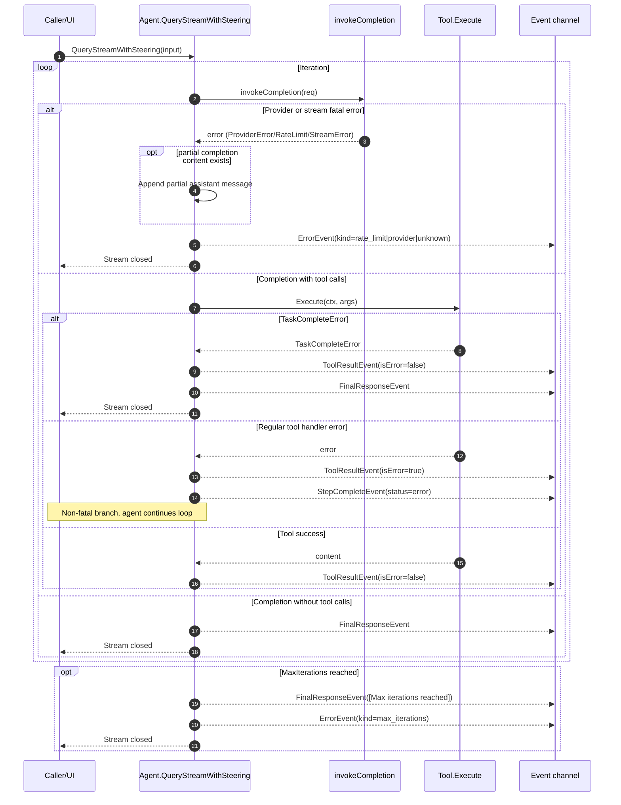

# Architecture

This document describes the current runtime architecture and component interactions.
Use `AGENTS.md` for fast orientation, then read only the sections needed for your task.

## Module Boundaries
- `sdk/agent/` owns loop orchestration, history state, event emission, tool dispatch, steering boundaries, and compaction integration (`sdk/agent/agent.go:20`, `sdk/agent/events.go:10`, `sdk/agent/agent.go:838`)
- `sdk/llm/` defines provider-neutral request/response contracts and stream event types (`sdk/llm/model.go:8`, `sdk/llm/model.go:24`, `sdk/llm/model.go:82`)
- `sdk/tools/` owns tool definition/execution, args normalization, schema generation, result serialization, and sandbox tools (`sdk/tools/tool.go:13`, `sdk/tools/args_normalize.go:18`, `sdk/tools/schema.go:8`, `sdk/tools/sandbox/sandbox.go:283`)
- `sdk/agent/compaction/` encapsulates token-threshold logic and summary generation (`sdk/agent/compaction/service.go:10`, `sdk/agent/compaction/service.go:99`, `sdk/agent/compaction/service.go:122`)
- `sdk/tokens/` contains optional cost/pricing utilities (`sdk/tokens/cost.go:80`)

## End-to-End Turn Lifecycle
Entry point: `QueryStreamWithSteering` (`sdk/agent/agent.go:197`).

1. **Bootstrap conversation context**
   - Insert system prompt when history is empty.
   - Append incoming user input.
   - References: `sdk/agent/agent.go:214`, `sdk/agent/agent.go:219`

2. **Boundary A: apply steering before provider call**
   - Drain steering channel and append steering as user-role messages.
   - References: `sdk/agent/agent.go:226`, `sdk/agent/agent.go:959`, `sdk/agent/agent.go:973`

3. **Prune ephemeral tool outputs**
   - Retain only recent ephemeral tool messages before model invocation.
   - References: `sdk/agent/agent.go:229`, `sdk/agent/agent.go:790`

4. **Build tool definitions for provider**
   - Only non-hidden tools are sent to the model.
   - References: `sdk/agent/agent.go:233`, `sdk/tools/tool.go:30`

5. **Invoke provider and emit immediate content/usage events**
   - Streaming is used when provider implements `StreamingChatModel`.
   - Usage/thinking/text events are emitted from completion output.
   - References: `sdk/agent/agent.go:241`, `sdk/agent/agent.go:255`, `sdk/agent/agent.go:259`, `sdk/agent/agent.go:262`

6. **Persist assistant output**
   - Assistant content and tool calls are appended to history.
   - References: `sdk/agent/agent.go:268`

7. **Continuation gate**
	- On `max_tokens`, auto-continue with a follow-up prompt.
	- Continuation notices are emitted as `AutoContinueEvent` metadata (not text deltas).
	- Partial/truncated tool calls are merged before execution.
	- Merged tool calls are validated as complete JSON objects; invalid merges trigger another continuation prompt instead of immediate tool execution.
	- References: `sdk/agent/agent.go:259`, `sdk/agent/agent.go:275`, `sdk/agent/agent.go:298`, `sdk/agent/agent.go:612`, `sdk/agent/events.go:113`

8. **Execute tool calls and emit tool lifecycle events**
   - Resolve tool name, normalize args, execute handler, append tool output.
   - Emit step/tool-call/tool-result/step-complete events.
   - If the repeated-tool loop guard skips a call, the agent appends synthetic
     error tool results for the skipped call and any remaining calls in that
     assistant message before injecting the loop-break user reminder. This keeps
     OpenAI-style assistant tool-call/tool-result history contiguous even when
     execution is intentionally skipped.
   - References: `sdk/agent/agent.go:340`, `sdk/agent/agent.go:382`, `sdk/agent/agent.go:396`, `sdk/agent/agent.go:440`, `sdk/agent/agent.go:380`, `sdk/agent/agent.go:387`, `sdk/agent/agent.go:445`, `sdk/agent/agent.go:446`

9. **Boundary B: apply steering after each tool execution**
   - Ensures steering never interrupts a tool call mid-flight.
   - References: `sdk/agent/agent.go:448`, `sdk/agent/agent.go:959`

10. **Compaction gate and completion decision**
    - Check token thresholds and compact if needed.
    - If no further tool calls are required, emit final response.
    - References: `sdk/agent/agent.go:452`, `sdk/agent/agent.go:838`, `sdk/agent/agent.go:333`

11. **Max-iteration fail-safe**
    - Emits `FinalResponseEvent` and `ErrorEvent(kind=max_iterations)`.
    - References: `sdk/agent/agent.go:455`, `sdk/agent/agent.go:461`, `sdk/agent/events.go:37`

## Surface-Facing Terminal Contract

When Goode or any other adapter consumes the SDK stream, these semantics are the anchor:

- `FinalResponseEvent{Content, ResponseID}` is the authoritative terminal answer for the turn.
- `UsageEvent.ResponseID` and `AutoContinueEvent.ResponseID` carry tracing metadata for the same provider response lineage; they are not answer text.
- `AutoContinueEvent` is observability metadata only. Adapters must not render it as assistant content.
- `WarnEvent` and `ErrorEvent` are first-class surfaced diagnostics, not optional debug noise.
- Adapters may rename fields (`response_id` vs `responseId`) or reshape envelopes, but they should not change the underlying meaning of the SDK events.

## Runtime Sequence Diagram (Mermaid)
The diagram below maps to the turn lifecycle in `QueryStreamWithSteering` (`sdk/agent/agent.go:197`) and the stream aggregation path (`sdk/agent/agent.go:473`).

```mermaid
sequenceDiagram
    autonumber
    participant Caller as Caller/UI
    participant Agent as Agent.QueryStreamWithSteering
    participant Steering as steeringCh
    participant LLM as ChatModel or StreamingChatModel
    participant Resolver as toolResolver
    participant Tool as Tool.Handler
    participant Compact as compaction.Service
    participant Events as Event channel

    Caller->>Agent: QueryStreamWithSteering(input)
    Agent->>Agent: Bootstrap system/user history

    loop Iteration (max MaxIterations)
        Agent->>Steering: drainSteering() Boundary A
        Steering-->>Agent: Optional steering messages
        Agent->>Agent: Prune ephemeral tool outputs
        Agent->>LLM: Invoke or stream completion
        LLM-->>Agent: Completion, deltas, usage
        Agent-->>Events: Text/Thinking/Usage events
        Agent->>Agent: Append assistant message

        alt stop_reason == max_tokens
            Agent->>Agent: Merge partial tool calls if needed
            Agent->>Agent: Inject continuation prompt
        else no tool calls and completion allowed
            Agent-->>Events: FinalResponseEvent
            break Completed
        else tool calls present
            loop For each tool call
                Agent->>Resolver: Resolve tool name
                Resolver-->>Agent: Tool or invalid fallback
                Agent->>Tool: Execute(normalized args, deps ctx)
                Tool-->>Agent: Tool content + metadata
                Agent-->>Events: StepStart/ToolCall/ToolResult/StepComplete
                Agent->>Steering: drainSteering() Boundary B
                Steering-->>Agent: Optional steering messages
            end
        end

        Agent->>Compact: ShouldCompact + MaybeCompact
        alt compacted
            Compact-->>Agent: Summary + compacted history
            Agent-->>Events: CompactionEvent
        end
    end

    Agent-->>Events: Close event stream
```

## Failure Path Sequence Diagram (Mermaid)
This diagram focuses on fatal vs non-fatal error branches in the main loop (`sdk/agent/agent.go:241`, `sdk/agent/agent.go:353`, `sdk/agent/agent.go:455`, `sdk/agent/agent.go:916`).



Related behavior notes:
- Tool handler errors are surfaced via `ToolResultEvent(isError=true)` and do not end the stream by themselves (`sdk/agent/agent.go:403`, `sdk/agent/agent.go:445`).
- Compaction failures are logged and skipped; they do not emit `ErrorEvent` or terminate the turn (`sdk/agent/agent.go:860`).

## Streaming Error Mapping Diagram (Mermaid)
This diagram details how `StreamErrorEvent` is converted to final `ErrorEvent` output (`sdk/llm/model.go:70`, `sdk/llm/stream_error.go:10`, `sdk/agent/agent.go:775`, `sdk/agent/agent.go:916`).

```mermaid
sequenceDiagram
    autonumber
    participant Provider as Provider stream parser
    participant Invoke as Agent.invokeCompletion
    participant AsError as StreamErrorEvent.AsError
    participant Loop as QueryStreamWithSteering loop
    participant MapErr as Agent.errEvent
    participant Fmt as formatRetryAfterMessage
    participant Events as Event channel

    Provider-->>Invoke: StreamErrorEvent{Err?, Provider, StatusCode, Message, RetryAfter}
    Invoke->>AsError: e.AsError()

    alt Err field is present
        AsError-->>Invoke: return Err directly
    else Err is nil, use metadata fallback
        alt StatusCode == 429
            AsError-->>Invoke: RateLimitError
        else Provider/Status/Message present
            AsError-->>Invoke: ProviderError
        else no metadata
            AsError-->>Invoke: generic error("stream error")
        end
    end

    Invoke-->>Loop: return partial completion + error

    opt partial content exists
        Loop->>Loop: append assistant partial message
    end

    Loop->>MapErr: errEvent(err)
    alt err is RateLimitError
        MapErr->>Fmt: formatRetryAfterMessage(msg, retryAfter)
        Fmt-->>MapErr: normalized message
        MapErr-->>Events: ErrorEvent(kind=rate_limit, status=429)
    else err is ProviderError
        MapErr->>Fmt: formatRetryAfterMessage(msg, retryAfter)
        Fmt-->>MapErr: normalized message
        MapErr-->>Events: ErrorEvent(kind=provider, status=provider code)
    else other error
        MapErr-->>Events: ErrorEvent(kind=unknown, provider=llm.Provider())
    end

    Loop-->>Events: stream ends after ErrorEvent
```

Mapping details:
- Streaming error conversion logic lives in `StreamErrorEvent.AsError()` (`sdk/llm/stream_error.go:10`).
- Streaming branch returns partial completion together with error when receiving `StreamErrorEvent` (`sdk/agent/agent.go:775`).
- Fatal loop behavior emits a single mapped `ErrorEvent` and returns (`sdk/agent/agent.go:246`, `sdk/agent/agent.go:252`, `sdk/agent/agent.go:253`).
- Error kind/status normalization is performed in `errEvent` (`sdk/agent/agent.go:916`, `sdk/agent/agent.go:923`, `sdk/agent/agent.go:928`, `sdk/agent/agent.go:935`).

## Streaming Aggregation
- Stream deltas are folded into one `Completion` by `invokeCompletion` (`sdk/agent/agent.go:541`)
- Text/thinking delta events are emitted incrementally while content accumulates (`sdk/agent/agent.go:555`, `sdk/agent/agent.go:572`)
- Response-level stream metadata populates `Completion.ResponseID` (not a separate agent event) (`sdk/agent/agent.go:582`, `sdk/agent/agent.go:606`, `sdk/llm/model.go:62`)

## Tooling Interaction Details
- Tool resolution is exact-name first, then normalized/alias fallback (`sdk/agent/tool_resolve.go:107`, `sdk/agent/tool_resolve.go:30`)
- Tool args pass through normalization + repair metadata before handler execution (`sdk/tools/args_normalize.go:18`, `sdk/agent/agent.go:382`)
- Tool execution context includes `tool_call_id` and mutable metadata storage (`sdk/tools/deps.go:27`, `sdk/tools/deps.go:56`, `sdk/agent/agent.go:396`)
- Metadata snapshot is attached to `ToolResultEvent` for UI correlation (`sdk/tools/deps.go:136`, `sdk/agent/agent.go:445`)
- Hidden `invalid` tool is auto-injected as fallback behavior for unknown tool names, and all `Tool.Hidden` entries remain executable internally while being filtered out of model-visible tool definitions.
- `TaskCompleteError` short-circuits to final response (`sdk/tools/task_complete.go:7`, `sdk/agent/agent.go:353`, `sdk/agent/agent.go:436`)

## Steering and TODO Coordination
- Steering messages emit `SteeringReceivedEvent` when applied (`sdk/agent/agent.go:980`, `sdk/agent/events.go:103`)
- When done-tool enforcement is disabled, incomplete TODOs inject a one-time hidden reminder prompt (`sdk/agent/agent.go:321`, `sdk/agent/agent.go:327`, `sdk/agent/agent.go:468`)
- `NotifyTodoCompletion` influences near-threshold compaction checks on future turns (`sdk/agent/agent.go:144`, `sdk/agent/agent.go:842`, `sdk/agent/agent.go:843`)

## Compaction Architecture
- Threshold calculation includes prompt, cached-prompt, and image tokens (`sdk/agent/compaction/service.go:72`, `sdk/agent/compaction/service.go:82`, `sdk/agent/compaction/service.go:89`)
- Trigger policy now combines an internal Tier 1 snip watermark, the legacy
  summary ratio threshold, and a hard overflow guard
  (`prompt_tokens >= context_window - reserve_output_tokens`) to force
  compaction before the model context is exceeded (`sdk/agent/compaction/service.go`).
- Agent caches `hasCompactor` and skips compaction callsites entirely when compaction is disabled (`sdk/agent/agent.go:50`, `sdk/agent/agent.go:312`, `sdk/agent/agent.go:443`)
- `checkAndCompact` is async: compaction runs in background on a context detached from the caller's turn cancellation, pending results are atomically applied at turn boundaries, and post-snapshot messages are appended to preserve work done during compaction.
- Compaction LLM invoke remains timeout-bounded via `CompactionTimeout`, with configurable retry/backoff before giving up (`sdk/agent/compaction/service.go:104`, `sdk/agent/agent.go:823`, `sdk/agent/agent.go:842`)
- Compaction prompt now supports model-aware selection (`SummaryPrompt` accepts string or `func(modelID string) string`) and keeps the 300-700 word/UNABLE_TO_SUMMARIZE contract (`sdk/agent/compaction/models.go:108`, `sdk/agent/compaction/models.go:192`, `sdk/agent/compaction/models.go:39`)
- Tool snapshot generation is still skipped for short summaries (threshold evaluated by rune count), and protected tool names can be prioritized via `ProtectedTools` (`sdk/agent/compaction/models.go:118`, `sdk/agent/compaction/service.go:124`, `sdk/agent/compaction/service.go:223`)
- Compaction summaries are tagged via message-name metadata so recent-user retention skips only SDK-authored summaries (`sdk/agent/compaction/service.go:154`, `sdk/agent/compaction/service.go:166`)
- Summary extraction is strict: it selects the last `<summary>`/`<compaction_summary>` block, and missing/empty blocks are treated as failures instead of silently compacting on raw text (`sdk/agent/compaction/models.go:132`, `sdk/agent/compaction/service.go:115`)
- Before invoking the summary model, compaction repairs assistant tool-call/tool-result pairs after destroyed ephemeral tool outputs are filtered. Incomplete assistant tool calls are stripped while preserving assistant text, and complete contiguous tool-result blocks are kept so OpenAI-style providers do not reject compaction requests as invalid tool history (`sdk/agent/compaction/service.go`).
- Tier 1 local compaction snips old eligible tool-result messages without
  invoking the summary model. It preserves tool role/linkage, stores or reuses a
  full-output artifact path, writes a monotonic ledger replacement, skips
  protected tools and protected recent messages, and leaves user messages
  untouched (`sdk/agent/compaction/local_reduce.go`).
- When all candidate messages are filtered, compaction injects a minimal fallback context message to keep summary input non-empty (`sdk/agent/compaction/service.go:139`)
- Compaction emits `CompactionEvent` when pending results are applied, and re-prepends deduplicated preserved system messages (`sdk/agent/agent.go:770`, `sdk/agent/agent.go:699`, `sdk/agent/agent.go:891`)
- `compaction.Result` is the structured telemetry carrier for compaction
  consumers. Current summary compaction fills `trigger`, `watermark`, `usage`,
  `original_tokens`, `new_tokens`, and `tiers_applied=["summarize"]`; adapters
  may reshape field names but should preserve these meanings.
- `compaction.Ledger`, `LedgerReplacement`, stable message keys, content hashes,
  `LedgerStore`, and `ArtifactWriter` are the portable persistence contract for
  local replacement reuse. The SDK defines schema, validation, and reduction
  behavior; repository adapters provide the file store and artifact writer.
- `CompactNow` forces a compaction run regardless of thresholds (unless another compaction is already in-flight) (`sdk/agent/agent.go:777`)

## Event and Error Contract
- Event types are stable integration points for UI/CLI consumers (`sdk/agent/events.go:10`)
- Main event classes: text/thinking, tool lifecycle, usage, compaction, final response, steering, and auto-continue metadata (`sdk/agent/events.go:13`, `sdk/agent/events.go:23`, `sdk/agent/events.go:46`, `sdk/agent/events.go:62`, `sdk/agent/events.go:88`, `sdk/agent/events.go:94`, `sdk/agent/events.go:84`, `sdk/agent/events.go:103`, `sdk/agent/events.go:113`)
- Error kinds are normalized to `rate_limit`, `provider`, `unknown`, `max_iterations` (`sdk/agent/events.go:37`, `sdk/agent/agent.go:916`)

## Architectural Invariants
- Only non-hidden tools are advertised to providers; hidden tools remain internal controls (`sdk/agent/agent.go:233`, `sdk/tools/tool.go:24`)
- Steering is only injected at deterministic boundaries, not during provider/tool execution (`sdk/agent/agent.go:226`, `sdk/agent/agent.go:448`)
- Compaction preserves system-message semantics by explicitly re-prepending deduplicated system messages after summary replacement, while also deduplicating any system messages returned by compacted payloads (`sdk/agent/agent.go:894`, `sdk/agent/compaction/service.go:122`)
